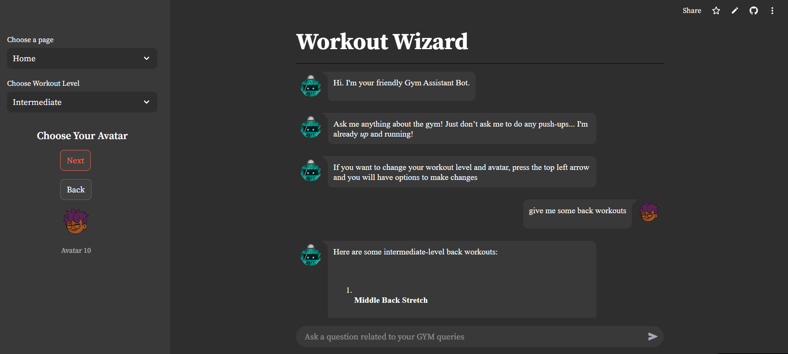

# Gym App

## Description
The Gym App is a comprehensive fitness application designed to enhance your workout experience using GENAI capabilities. It offers various workout routines for users based on the workout level selected. It also has
a choose avatar feature to select your avatar when communicating with the application.

## Technologies Used
- Python 3.10
- GPT-4o
- Pinecone Database
- Streamlit for web framework


<div align="center">
    
    <p><em>Gym Chat app</em></p>
</div>


## Requirements
Create a .env file and place the following api keys inside:
- openai api key 
- Pinecone api key

Add the following lines to your `.env` file:

OPENAI_API_KEY = "{ OPENAI_API_KEY }"

PINECONE_API_KEY = "{ PINECONE_API_KEY }"

example  PINECONE_API_KEY = "02f59c2f-5ff8-49ab-b6d1-eb7a357aa1da"

## Installation
To get started with the Gym App, follow these steps:

1. Clone the repository:
   ```bash
   git clone https://github.com/yourusername/Gym-app.git

2. Navigate into the project directory:
   ```bash
   cd Gym-app

3. Create and activate a virtual environment:
   ```bash
   cd Gym-app\gym_rag\Scripts
   activate

4. Install the required packages:
   ```bash
   cd back into Gym-app
   pip install -r requirements.txt

6. Run the application:
   ```bash
   streamlit run main.py

## Usage

Once the app is running, navigate to http://localhost:8501 in your web browser. Follow the on-screen instructions to create an account and start your fitness journey.


   

